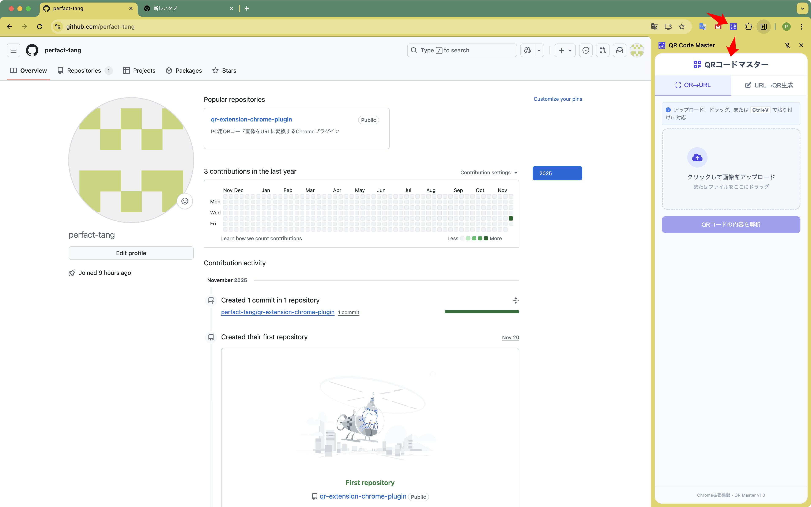

# qr-extension-chrome-plugin
PC用QRコード画像をURLに変換するChromeプラグイン


# Vibe Coding

- Gemini(https://gemini.google.com/)の思考モード(3Pro)でVibe
- Prompt:
```
1. プラグインのインターフェースと操作方法:
- ブラウザツールバーのプラグインアイコンをクリックすると、ページの右側にサイドバーパネルが表示されます。
- サイドバーは、クリーンなカラースキームを採用したモダンなUIデザインを採用しています（明るい色を推奨）。
- サイドバーには、「QR画像からURLへ」と「URLからQR画像へ」の2つの機能タブがあります。

2. QR画像からURLへの機能実装:
- 3つの画像入力方法を提供します。
a) ファイルアップロードボタン（PNG/JPGなどの一般的な画像形式に対応しています）
b) ドラッグ＆ドロップエリア（QR画像ファイルのドラッグ＆ドロップに対応しています）
c) クリップボード機能（Ctrl+Vショートカットでクリップボードから画像を貼り付けることができます）
- 画像プレビューエリアを表示します。
- 「変換」ボタンを追加します。このボタンをクリックすると、QRコードの内容を解析し、抽出されたURLを表示します。
- エラー処理: 無効なQRコードプロンプト、画像形式エラープロンプトなど。

3. URLからQR画像への変換機能の実装:
- URL入力テキストボックス（形式検証機能付き）を提供します。
- 「生成」ボタンを追加します。このボタンをクリックすると、対応するQRコード画像が生成されます。
- 生成されたQRコードのプレビューを表示する（サイズ変更可能）
- ダウンロードボタンを提供する（PNG形式でのダウンロードをサポート）
- QRコードのパラメータを設定可能（サイズ、エラー訂正レベルなど）

4. 技術要件
- Chrome拡張機能マニフェストv3仕様に基づいて開発されている
- フロントエンドは最新のCSSフレームワーク（TailwindCSSなど）を使用している
- QRコードの解析/生成には信頼性の高いオープンソースライブラリ（qrcode.jsなど）を使用している
- さまざまな画面サイズに対応するレスポンシブデザインを実装している

5. その他の要件
- 読み込みステータスインジケーターを追加する
- すべてのユーザーアクションに視覚的なフィードバックを提供する
- ユーザーフレンドリーなエラーメッセージを提供する
- 一貫したカラースキームで、クリーンで美しいUIを維持する

6. 成果物
- Chrome拡張機能の完全なパッケージ（ストアへの公開準備が整っている）
- ソースコード（必要なコメントを含む）
- ユーザーマニュアル
```


## 拡張機能の使用方法

### 🚀 拡張機能のロード（インストール）手順

1.  Chromeブラウザを開き、アドレスバーに `chrome://extensions/` と入力してアクセスします。
2.  画面右上にある **「デベロッパーモード」** をオンにします。
3.  左上にある **「パッケージ化されていない拡張機能を読み込む」** をクリックします。
4.  あなたの `qr-extension-chrome-plugin` フォルダを選択します。

### 💻 機能の使用方法

* **拡張機能のアイコンを見つける：**
    ブラウザのツールバーにあるあなたの拡張機能のアイコンを見つけて、クリックします。

* **識別（QRコード→URL）機能：**
    * デスクトップ上のQRコード画像をドラッグ＆ドロップするか、スクリーンショットを撮った後、直接 **`Ctrl + V`** で貼り付けます。
    * **「QRコードの内容を解析」** をクリックしてURLを確認します。

* **生成（URL→QRコード）機能：**
    * タブを切り替えます。
    * URLを入力し、**「QRコードを生成」** をクリックします。
    * 必要に応じてサイズを調整し、**「PNG画像をダウンロード」** をクリックして保存します。

